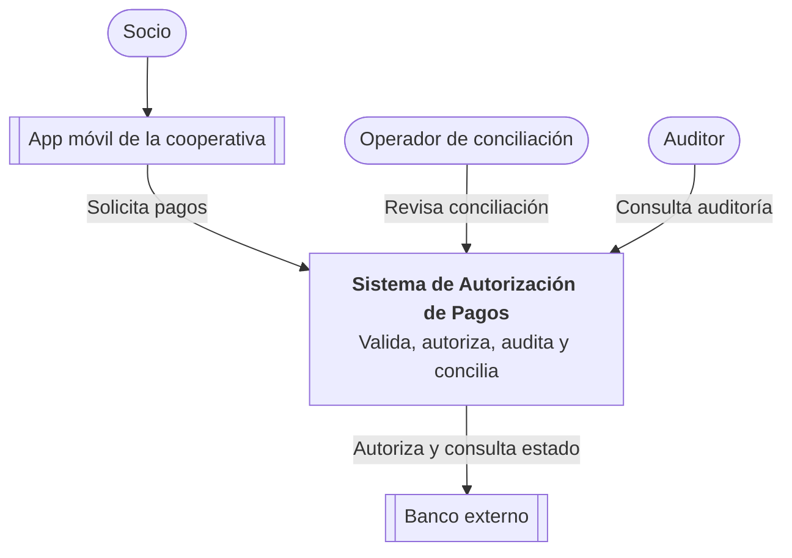
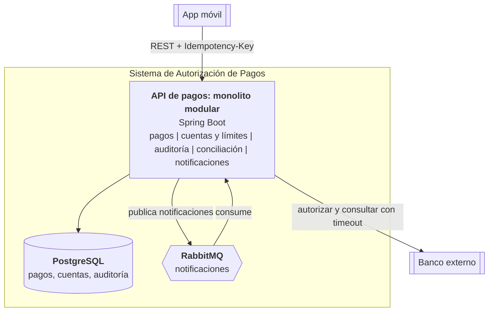
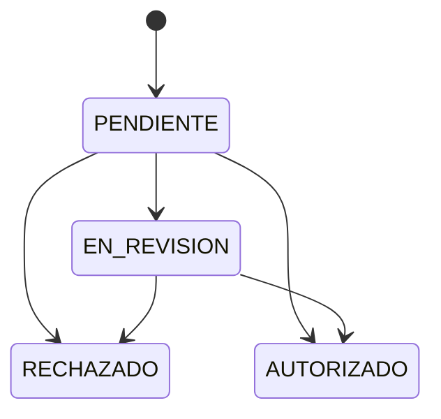
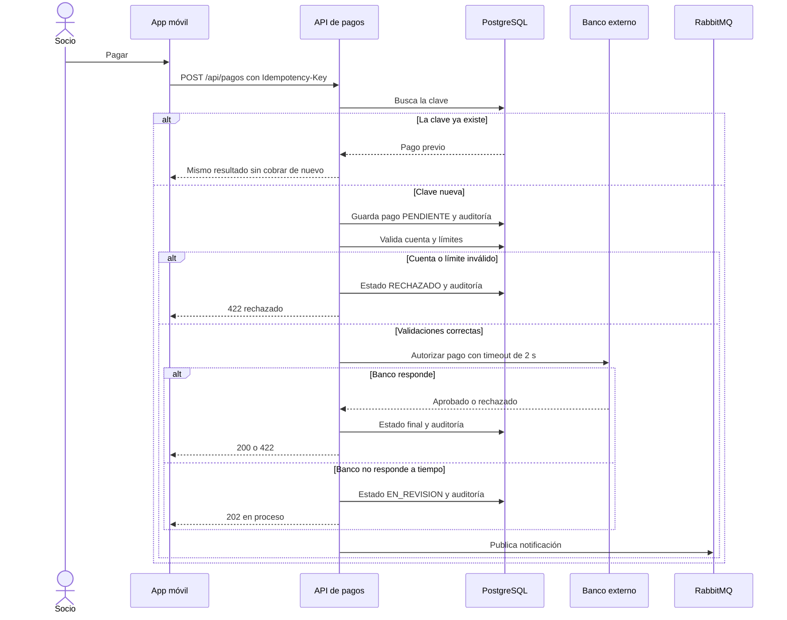
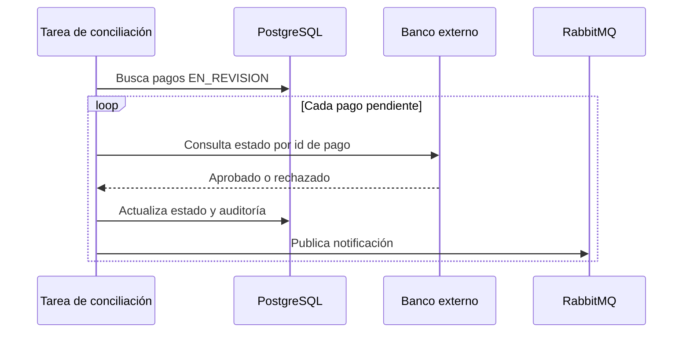

# Caso 2 — Autorización de pagos

Sistema para una cooperativa que recibe pagos desde su aplicación móvil. Valida la cuenta, verifica límites, registra **cada intento** (incluso si el banco falla) y concilia después los pagos que quedaron inciertos.

## 1. Objetivo, actores y alcance

**Objetivo:** autorizar pagos de forma segura, sin cobrar dos veces, con trazabilidad completa y tolerancia a fallos del banco externo.

| Actor | Rol |
|---|---|
| Socio | Realiza pagos desde la app móvil |
| App móvil | Cliente que envía la solicitud con una clave de idempotencia |
| Banco externo | Autoriza y ejecuta el movimiento de dinero |
| Operador de conciliación | Revisa pagos en revisión y diferencias |
| Auditor | Consulta el historial de cada intento |

**Dentro del alcance:** recibir la solicitud, validar cuenta y límites, control de idempotencia, llamada al banco, respuesta al cliente, auditoría, notificación y conciliación.

**Fuera del alcance (v1):** autenticación del socio (la resuelve un gateway), reversos y contracargos, antifraude avanzado, apertura de cuentas.

## 2. Requisitos

**Funcionales**
- RF1. Recibir una solicitud de pago con una clave de idempotencia.
- RF2. Validar que la cuenta exista y esté activa.
- RF3. Verificar el límite por pago y el límite diario acumulado.
- RF4. Autorizar el pago contra el banco externo con un tiempo máximo de espera.
- RF5. Registrar en auditoría cada intento y cada cambio de estado.
- RF6. Notificar al socio el resultado de forma asíncrona.
- RF7. Conciliar los pagos en estado incierto contra el banco.

**Calidad**
- Exactitud: un mismo pago nunca se cobra dos veces.
- Latencia: p95 de autorización menor a 3 s (timeout al banco de 2 s).
- Disponibilidad: si el banco falla, el sistema responde y registra el intento.
- Auditoría: registros solo de inserción, sin edición ni borrado.
- Seguridad: TLS, cuenta enmascarada en logs y auditoría.
- Observabilidad: estados claros y métricas por estado.

## 3. Diagramas C4

### Nivel 1: Contexto



### Nivel 2: Contenedores



### Estados de un pago



## 4. Flujo de una operación crítica: autorizar un pago



### Conciliación posterior



## 5. Decisiones y stack

**¿Qué pasos son síncronos?** Buscar la clave de idempotencia, registrar el intento, validar cuenta y límites, llamar al banco (con timeout) y responder. El socio necesita el resultado en la misma petición.

**¿Qué se procesa en segundo plano?** Notificaciones al socio (RabbitMQ), conciliación periódica y reportes.

**¿Cómo se evita cobrar dos veces?**
- Cada solicitud lleva una `Idempotency-Key`, con restricción `UNIQUE` en PostgreSQL.
- Si la clave ya existe, se devuelve el resultado guardado sin llamar al banco.
- Si la misma clave llega con otra cuenta o monto, se responde 422.
- Si dos solicitudes con la misma clave llegan a la vez, la restricción única deja pasar solo una.
- Al banco se envía el id del pago como referencia, para que también sea idempotente de su lado.

**¿Qué pasa si el banco responde tarde o no responde?** Tras 2 s el pago pasa a `EN_REVISION` y se responde 202 (en proceso). No se reintenta el cobro a ciegas: la conciliación consulta el estado real al banco, cierra el pago y notifica.

**¿Qué queda en la auditoría?**

| Dato | Ejemplo |
|---|---|
| Id del pago y clave de idempotencia | UUID y clave del cliente |
| Cuenta enmascarada y monto | ****0001, 50.00 |
| Evento | SOLICITUD_RECIBIDA, RESULTADO_AUTORIZADO, REINTENTO_IDEMPOTENTE, CONCILIACION |
| Motivo y referencia del banco | LIMITE_DIARIO, BCO-1a2b3c4d |
| Fecha y hora de cada evento | Marca de tiempo UTC |

| Tecnología | Justificación |
|---|---|
| Spring Boot (Java 21) | Estándar del curso, transacciones y validación maduras |
| PostgreSQL | ACID y restricciones únicas para idempotencia |
| REST + OpenAPI (Swagger UI) | Contrato claro para la app móvil y pruebas manuales |
| RabbitMQ | Notificaciones y mensajería simple con colas |
| Docker Compose | Entorno reproducible en Codespaces |
| Kafka | No se usa: no hay necesidad de reproducir historial ni volumen masivo |
| Redis | No se incluye: no hay una necesidad de caché demostrada |

## 6. ADR

### ADR-001 (arquitectónica): Autorización síncrona e idempotente con estado EN_REVISION
- **Estado:** aceptada
- **Contexto:** el socio espera una respuesta inmediata, pero el banco externo puede tardar o fallar y un reintento no debe duplicar el cobro.
- **Decisión:** monolito modular que autoriza de forma síncrona con timeout de 2 s. La idempotencia se garantiza con clave única en PostgreSQL. Ante fallo del banco el pago queda `EN_REVISION` y se resuelve por conciliación.
- **Consecuencias:** nunca se cobra dos veces y el sistema siempre responde. Costo: el socio puede recibir 202 y esperar la notificación.
- **Alternativas descartadas:** microservicios (complejidad sin beneficio actual) y flujo totalmente asíncrono (peor experiencia de respuesta).

### ADR-002 (tecnológica): RabbitMQ en lugar de Kafka para notificaciones
- **Estado:** aceptada
- **Contexto:** hay que notificar resultados sin bloquear la autorización y sin atar el pago al canal de notificación.
- **Decisión:** publicar un mensaje en RabbitMQ al cerrar cada pago. Si la publicación falla, el pago no se afecta.
- **Consecuencias:** desacople y simplicidad operativa. Costo: la publicación no es atómica con la base de datos (ver riesgo 3).

## 7. Riesgos

| Riesgo | Mitigación |
|---|---|
| Banco lento o caído | Timeout de 2 s, estado EN_REVISION, conciliación; a futuro, circuit breaker |
| Doble cobro por reintentos concurrentes | Clave UNIQUE, comparación de la solicitud y referencia idempotente al banco |
| Notificación perdida (publicación no atómica con la base) | La publicación no bloquea el pago; la conciliación vuelve a notificar; a futuro, patrón outbox |

**Limitación conocida:** dos pagos simultáneos de la misma cuenta podrían pasar a la vez el límite diario. Se resolvería bloqueando la fila de la cuenta (`SELECT ... FOR UPDATE`).

## 8. Métricas

**Negocio:** pagos duplicados (meta: 0). Complementaria: tasa de pagos autorizados con éxito.

**Técnica:** latencia p95 de autorización (menor a 3 s). Complementarias: tasa de errores y tiempo de conciliación (de EN_REVISION a estado final).

---

## Estado de la implementación

| Componente | Estado |
|---|---|
| Validación de cuenta y límites, idempotencia, auditoría, conciliación, notificaciones | Implementado |
| Banco externo | Simulado (`BancoSimulado`): 999.99 = timeout, 13.13 = rechazo |
| Autenticación, reversos, antifraude, outbox | No incluido |

## Cómo ejecutar

```bash
docker compose up --build -d
docker compose ps
docker compose logs -f backend
docker compose down
```

- En Codespaces abre el panel **Ports** y haz clic en el globo del puerto 8080.
- La raíz `/` muestra enlaces. Swagger UI: `/swagger-ui/index.html`. Salud: `/api/health`.
- Auditoría de un pago: `GET /api/pagos/{id}/auditoria`.
- RabbitMQ (usuario y clave `guest`): puerto 15672.
